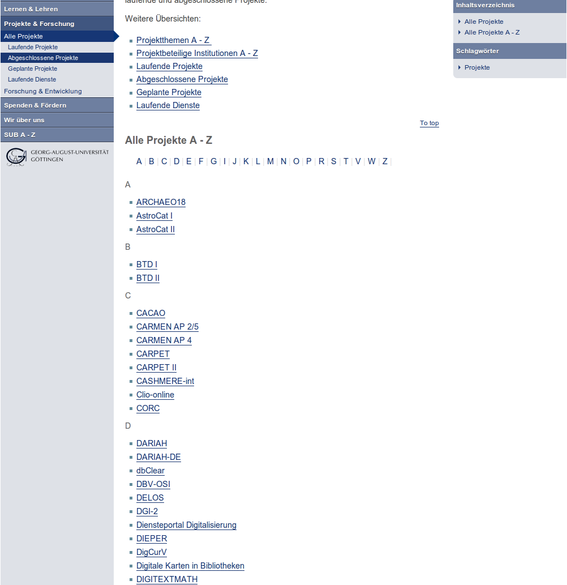
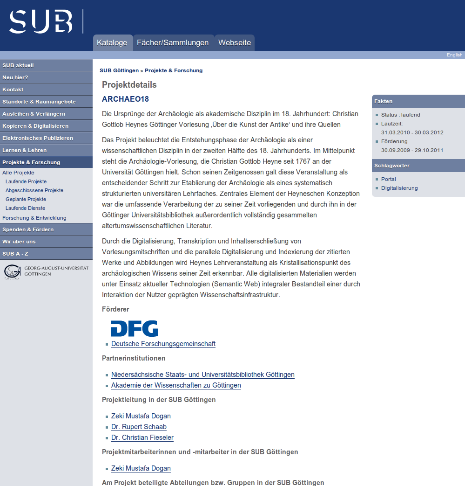

.. footer:: Manual nkwsubfeprojects $Id: Manual.rst 1719 2012-03-02 13:22:02Z pfennigstorf $

Projekte (nkwsubfeprojects)
===============================

Extension, die Projekte im Backend erfasst und im Frontend ausgibt.

.. contents:: Inhaltsverzeichnis

Darstellung
-----------

Bei der Darstellung existiert pro Domaene jeweils eine Listen- und eine Detailansicht. In der Detailansicht wird die Sidebar konsequent durch das Plugin genutzt, daher sollte das Backendlayout im TYPO3 so konfiguriert sein, dass diese nicht angezeigt wird.

Installation
------------

Installation der Extension im Extension Manager. Danach die die Datenbankupdates durchfuehren, damit die Datenbankstruktur stimmt.

.. hint::
   Anschliessend auf der obersten Ebene des TypoScripts das mitgelieferte TypoScript einbinden und die Persistence Einstellungen zur StoragePid setzen.

Erfassung
---------

Bilder
------

Bilder koennen ueber das Backendeingabefeld "Images" hinzugefuegt werden. Dort pro Logo / Bilddatei auf "Create New"
klicken und die Datei auswaehlen und mit einer Bildunterschrift versehen.

Aufteilung (Plugins)
--------------------

Die Benennung der Plugins ist aufgrund der historischen Gegebenheiten (stammt aus piBase Extension) so erhalten geblieben.

pi1 (Project List)
~~~~~~~~~~~~~~~~~~

Anzeige der Projekte als Liste mit Verlinkung auf eine Detailansicht (pi2).

Zur Filterung der Projekte kann nach dem Einbinden des Plugins als Content Element die Anzeige nach Projektstatus eingeschraenkt werden.
Moegliche Filterkriterien sind durch die Auswahl eines Flexformfeldes beim Bearbeiten des Content Elements moeglich:

- Geplant (1)
- Laufend (2)
- Abgeschlossen (3)
- Laufender Service (4)
- Abgeschlossen und laufender Dienst (5)
- Alle Projekte (x)

Zur Darstellung der alphabetischen Liste wurde ein Fluid Widget geschrieben, dass die Ausgabe steuert. Dieses Widget ist universell fuer jede Art von Liste einsetzbar.

pi2 (Project Details)
~~~~~~~~~~~~~~~~~~~~~

Anzeige der Projektdetails mit einer Sidebar, in der Fakten und Projektkeywords angezeigt werden.
Die Anzeige der Keywords beschraenkt sich derzeit auf die festen Keywords (s.u.), da hier auch noch eine Loesung gegen den Keywordwildwuchs und die Redundanz gesucht wird

Sofern vorhanden werden Institutionsbilder mit eingebunden. Die Institutionen werden in einer separaten Datenbanktabelle gespeichert und bei der Erfassung referenziert.

pi3 (Project Keyword List)
~~~~~~~~~~~~~~~~~~~~~~~~~~

Projekte besitzen eine eigenstaendige Keywordtabelle, in der die sogenannten "festen" Keywords zentral gepflegt werden. Da diese Keywords in vielen Faellen nicht ausreichen, wurde zusaetzlich die Moeglichkeit geschaffen in einem Freitextfeld weitere Keywords anzugeben.

pi4 (Project Keyword Details)
~~~~~~~~~~~~~~~~~~~~~~~~~~~~~

Anzeige der Projekte zu einem bestimmten Keyword. Die Sortierung der Projekte erfolgt alphabetisch. Jedes angezeigte Projekt wird auf die Projektdetailseite (pi2) verlinkt.

pi5 (Project Institution List)
~~~~~~~~~~~~~~~~~~~~~~~~~~~~~~

Liste aller Institutionen und Verlinkung zu der Detailseite (pi6), auf der weitere Informationen zu der Institution dargestellt werden

pi6 (Project Institution Details)
~~~~~~~~~~~~~~~~~~~~~~~~~~~~~~~~~

Technisches
-----------

Die Extension und Daten stammen aus der F&E Abteilung der SUB Göttingen und wurden ohne TYPO3 auf rdd.sub.uni-goettingen.de eingesetzt.
Ursprünglich war diese Extension piBase basiert, aufgrund vieler Anfälligkeiten bezüglich Workspaces wurde eine Migration auf Exbase und Fluid durchgeführt.

Im Kern besteht die Extension aus den Entitäten Projekte, Institutionen und Schlagworten.
Als Value Objekte stehen zusätzlich noch Personen und Gruppen zur Verfügung, die teils aufgelistet und referenziert werden.

Jede Entität besitzt einen eigenen Controller, jeder Controller hat eine list- und Detail Action.

Die Templates sind modular aufgebaut und besitzen ein gemeinsames Layout. Wiederkehrende Teile sind in Partials ausgelagert.

View
----

Der View wird in Fluid realisiert. Fuer die Darstellung der Listen ist die Einbindung der Extension tmpl_sub noetig, da dort das zentral genutzte Widget fuer die A-Z Darstellung der Komponenten hinterlegt ist.

TypoScript
----------

Default TypoScript ist in Configuration/TypoScript/ vorhanden.

TODO
----

- Freie Keywords rendern und in die festen integrieren.
- Blackout Anzeige
- Nowrap bei englischen Daten