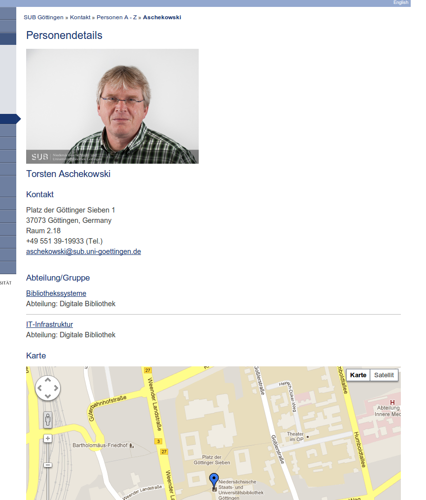
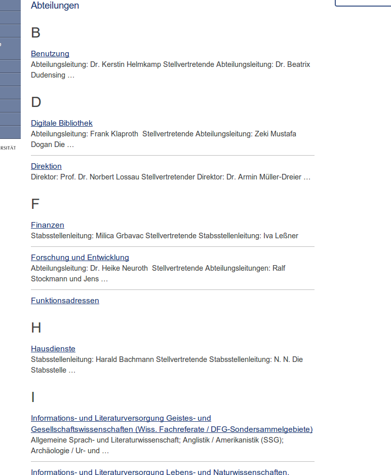

Aktuelle und wichtige Änderungen
================================

2012-12-12
----------

Ein kleiner Rerelaunch mit neuen Features, neuen Tabs, besserer Semantik und einer verbesserten Darstellung der Personen- und Gruppen.

Tabs
****

Die Tabs wurden grundlegend überarbeitet und erscheinen nun in einer Farbkomposition, die eine erhöhte Sichtbarkeit gewährleistet.

  Vorher:

  .. figure:: Images/Tabs-vorher.png

  Nachher:

  .. figure:: Images/Tabs-nachher.png

Neben der optischen Anpassung wurde auch das Feature zum Durchreichen des Suchbegriffs durch alle Tabs integriert.
Somit verschwindet der Suchbegriff beim hin- und herschalten zwischen den Tabs nicht mehr, sondern bleibt erhalten.

Unter der Haube wurde ein fast kompletter Rewrite des JavaScripts durchgeführt, der zu sauberem und fehlerfreieren Code geführt hat.

Layout
******

Das Layout und die Anordnung der Elemente im Quelltext wurde umgestellt, so dass die Integration einer Responsive Version der Seite gut durchführbar ist.

Die teilweise noch vorhandenen runden Ecken sind nur noch in den Tabs zu finden.

Im Quelltext der Seite befinden sich Skiplinks, die das einfache, direkte Springen zum Inhalt für bestimmte, von behinderten Menschen benutzte Endgeräte ermöglicht.

Personen- und Gruppendatenbank
******************************

Die Extension wurde komplett neu geschrieben und basiert nun auf Extbase und Fluid.

Mit diesem Schritt wurden die folgenden Extensions überflüssig, da sie in die neue (substaff) integriert sind:

* nkwsubstaff
* nkwaddressextend
* nkwtcaaddress

Personenliste
^^^^^^^^^^^^^

Im Frontend sieht der Besucher eine aufgeräumte Liste der Personen, die im Gegensatz zu vorher wichtige Informationen zu der Person innerhalb der SUB anzeigt.

http://www.sub.uni-goettingen.de/kontakt/personen-a-z/

Dazu gehören neben dem Namen, der mit der Detailansicht verlinkt ist, die Telefonnummer, E-Mail Adresse und Gruppenzugehörigkeit.

Ist in dem Personendatensatz ein Bild hinterlegt wird dies in der Listenansicht ebenfalls dargestellt.

Die Auszeichnung der verschiedenen Informationen im Quelltext erfolgte mit semantischen Tags, so dass sie auch von Maschinen gelesen und verarbeitet werden können.

Personendetails
^^^^^^^^^^^^^^^
Die Anzeige der Personendetails wurde semantisch und optisch stark optimiert.

Zugehörige Gruppen und Abteilungen werden übersichtlicher dargestellt, bei Gruppen ist die übergeordnete Abteilung sichtbar.

Zu der Person kann bei Bedarf eine Karte angezeigt werden, die den Standort der Person visualisiert.

Gruppenliste
^^^^^^^^^^^^

Die Gruppenliste wird im gleichen Paradigma wie die Personenliste dargestellt. So werden Informationen zu der Abteilung, oder bei Gruppen die übergeordnete Abteilung direkt in der Liste angezeigt.

Gruppendetails
^^^^^^^^^^^^^^

Einzelne Gruppen werden übersichtlicher angezeigt. Neben dem Informationstext ist die übergeordnete Abteilung mit einem Teaser sichtbar.

Darunter findet sich eine Mitarbeiterliste, die im selben Format wie in der Personenliste mit allen wichtigen Informationen angezeigt wird.

Pflege im Backend
^^^^^^^^^^^^^^^^^

Die Bearbeitung der Personen im Backend wurde stark normalisiert. Da Titel, Funktion und Standort aus einer zentralen Datenbank kommen, brauchen diese Daten nur an einer Stelle zentral für alle Benutzer gepflegt zu werden.

Aus dem Standort (im Screenshot "Building") werden automatisch die Koordinaten für die Frontendanzeige mit der Karte gezogen, so dass diese hier nicht mehr eingetragen werden müssen.

Navigation
**********

Die Anzeige der Untermüpunkte ab einer bestimmten Ebene erfolgte in der Sidebar, das aus Sicht der Usability suboptimal war. Untermenüpunkte werden nun in der Navigationsspalte dargestellt.