Grundlagen
----------

Einführung
~~~~~~~~~~

In dieser kurzen Einführung werden die wichtigsten Möglichkeiten, die TYPO3 den **Web-Autoren und -Redakteuren** bietet, kurz und in der Form von einfachen "Kochrezepten" Schritt für Schritt erläutert.

Was ist TYPO3?
""""""""""""""

TYPO3 ist ein freies Open Source Content-Management-System für Internet- und Intranetauftritte. TYPO3 wird seit 1997 von dem Dänen Kasper Skårhøj mit der Hilfe und Anregung von TYPO3-Nutzern entwickelt. Die hier beschriebene Version 4.6.8 ist seit April 2012 verfügbar. Weitere Informationen über TYPO3 sind unter http://typo3.org abrufbar.

Was ist ein Content-Management-System?
""""""""""""""""""""""""""""""""""""""

Content-Management-Systeme trennen **Inhalt, Struktur** und **Layout** von Dokumenten und integrieren die Bearbeitung und Pflege von Dokumenten in einen **definierten Arbeitsablauf** (Workflow). Das hat für die Autoren und Redakteure den Vorteil, dass sie sich ganz auf die Pflege und Aktualisierung von Texten konzentrieren können, ohne sich um das Layout, die Einbindung ihrer Seite oder andere technische Aspekte kümmern zu müssen.

Welche Vorteile bietet es?
""""""""""""""""""""""""""

Die Inhalte (Texte, Bilder, Dateien etc.) der Webseite können jetzt von den inhaltlich zuständigen Personen der jeweiligen Abteilungen und Gruppen über einen Web-Browser selbständig erstellt und gepflegt werden – und zwar ohne besonderes technisches Know-how. Das Web Content-Management-System TYPO3 ist sehr einfach zu erlernen, man braucht keine Vorkenntnisse in HTML oder Java Script. Für die Web-Autoren und -Redakteure wird das Anlegen neuer Inhalte und die Aktualisierung bestehender Inhalte somit stark erleichtert.

Zugang
~~~~~~

Alles im Webbrowser
"""""""""""""""""""

TYPO3 ist ein Online-Redaktionssystem und verwendet als Client nur einen üblichen **Web-Browser**. Sie können somit jederzeit von jedem Ort mit **Internet-Zugang** Veränderungen an Ihrer Webseite vornehmen.

Frontend
""""""""

Das sogenannte Frontend von TYPO3 ("vordere Seite") ist die Webseite, die den Internetnutzern angezeigt wird, in unserem Fall der neue Webauftritt der SUB Göttingen. Der Zugriff kann mit jedem beliebigen Web-Browser erfolgen, auch mit älteren Versionen und auch ohne spezielle Funktionen wie Cookies oder JavaScript. Im Allgemeinen ist auch kein Login notwendig (nur bei passwortgeschützten Webseiten). Der Zugriff auf die Webseiten erfolgt im Allgemeinen über eine URL der Form: 

* http://webservername/
* Für die SUB: https://www.sub.uni-goettingen.de

Backend
"""""""
.. _Backend:

Das sogenannte **Backend** von TYPO3 ("hintere Seite") ist das Content-Management-System, mit dem die Webseiten erstellt und editiert werden. Der Zugriff ist **nur für berechtigte Personen**, die sogenannten Web-Autoren oder -Redakteure möglich (Login, siehe Abschnitt 1.2.4). Sie brauchen dafür einen Benutzernamen und ein Passwort mit einer entsprechenden TYPO3-Berechtigung.  

Der Zugriff kann mit allen gängigen **neueren Web-Browsern** erfolgen. **Cookies** und **JavaScript** müssen eingeschaltet sein und **Popup-Fenster** müssen für diesen Server erlaubt sein. 

Browsereinstellungen z.B. für Firefox überprüfen und ggf. ändern:

* **Pop-Up-Fenster erlauben:** über Extras auf Einstellungen gehen, dort im Ordner Inhalt 
   * entweder das Häkchen bei Pop-up-Fenster blockieren entfernen
   * oder Häkchen setzen und Ausnahme für die URL der Webseite hinzufügen 
* **JavaScript ermöglichen:** Häkchen bei JavaScript aktivieren
* **Cookies ermöglichen:** im Ordner Datenschutz: Firefox wird eine Chronik anlegen oder Firefox wird eine Chronik nach benutzerdefinierten Einstellungen anlegen (Häkchen bei Cookies akzeptieren setzen und Behalten bis Firefox geschlossen wird) auswählen
* **Verschlüsselung:** im Ordner Erweitert: unter Verschlüsselung Haken entfernen bei TLS 1.0 verwenden

Die Verwendung des speziellen Rich Text Editors (siehe Kapitel 3) ist in den gängigen aktuellen Web-Browsern möglich.  
Der Zugriff auf das Backend erfolgt im Allgemeinen über eine URL der Form:

* http://webservername/typo3
* Für die SUB (Live): https://www.sub.uni-goettingen.de/typo3

Die Endung **/typo3** wird lediglich an die URL Ihrer Webseite angefügt. Sie müssen gegebenenfalls noch ein Sicherheitszertifikat herunterladen, um in das Backend der Webseite zu gelangen.

**Hinweis:** Nur für die Schulungen wird die Adresse des Entwicklungsservers verwendet: https://w3d.sub.uni-goettingen.de/typo3

Dort befindet sich auch die Spielwiese für Web-Beauftragte zum Testen.

Login zum Editieren
"""""""""""""""""""

Wenn Sie die Backend-Adresse in Ihrem Web-Browser eingeben, erscheint eine Seite mit folgendem Dialogfeld:

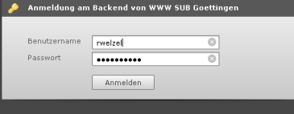

Geben Sie bitte Benutzername und Passwort ein und klicken Sie **Anmelden**. (Ihr Benutzername und ihr Passwort sind identisch mit Ihrem GWDG-Account. **Ausnahme:** Web-Beauftragte, die erst ab dem Jahr 2010 einen GWDG-Account bekommen haben).

Bei erfolgreichem Login erscheint Ihre **persönliche Benutzeroberfläche** (siehe Kapitel 1.3).

Übung
~~~~~

Kurs Teil 1
"""""""""""

* Starten Sie den Web-Browser
* Überprüfen Sie die Browsereinstellungen wie in :ref:`Backend <Backend>` beschrieben und ändern Sie ggf. die Einstellungen
* Geben Sie die URL des TYPO3-Backends ein
* Melden Sie sich mit Ihrem Benutzernamen und Passwort an

Kurs Teil 2
"""""""""""

* Starten Sie den Web-Browser
* Überprüfen Sie die Browsereinstellungen wie in :ref:`Backend <Backend>` beschrieben und ändern Sie ggf. die Einstellungen
* Geben Sie die URL des TYPO3-Backends ein
* Melden Sie sich mit Ihrem Benutzernamen und Passwort an

Benutzeroberfläche
~~~~~~~~~~~~~~~~~~

Jeder Benutzer sieht den gesamten Seitenbaum, kann aber nur diejenigen Seiten editieren, für die er berechtigt ist.

**Übrigens**: Für das Arbeiten in den Workspaces (Arbeitsumgebungen) gibt es eine Übersicht im Kapitel :ref:`Workspaces <Workspaces>`.

Aufbau
""""""

Die Arbeitsoberfläche von TYPO3 ist in drei Hauptbereiche unterteilt.

#. Links sehen Sie die Modulleiste. Hier wählen Sie aus, welche Art von Arbeiten Sie durchführen wollen.
#. In der Mitte sehen Sie den Seiten- oder Dateienbaum. Hier wählen Sie aus, welche Webseite oder welchen Dateien-Ordner Sie bearbeiten wollen.
#. Rechts sehen Sie die Arbeitsfläche. Hier führen Sie Ihre Arbeiten durch.

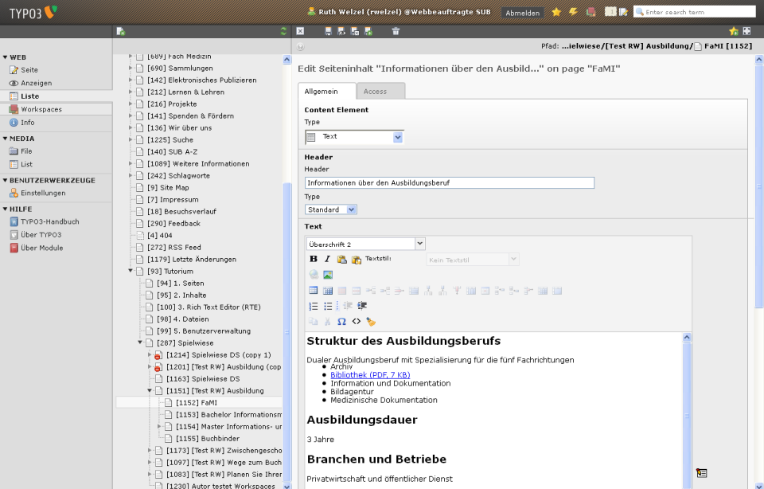

Die Anordnung der drei Bereiche entspricht auch der Reihenfolge bei der Arbeit:

#. Zuerst in der **Modulleiste** das Modul auswählen (z.B. Web / Liste),
#. dann im **Seitenbaum** die Webseite auswählen (z.B. FaMI) und
#. dann in der **Arbeitsfläche** die eigentliche Arbeit an dieser Webseite durchführen.

Modulleiste
"""""""""""

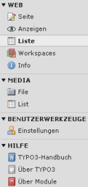

Durch Klicken auf die Modulbezeichnungen gelangen Sie in den entsprechenden Arbeitsbereich.
Die wichtigsten Module sind: 

+--------------------------------------------+---------------------------+
| Symbol                                     | Bedeutung                 |
+============================================+===========================+
| .. image:: ../Img/icon-web-liste.png       | Web / Liste (Web / List)  |
+--------------------------------------------+---------------------------+
| .. image:: ../Img/icon-web-workspaces.png  | Web / Workspaces          |
+--------------------------------------------+---------------------------+
| .. image:: ../Img/icon-media-file.png      | Datei (Media / File)      |
+--------------------------------------------+---------------------------+

Seitenbaum
""""""""""

Der **Seitenbaum** steht Ihnen für alle Module der **Modulgruppe Web** zur Verfügung. Er stellt die Struktur Ihrer Webseite baumartig dar.

In der **Modulgruppe Media** wird stattdessen der **Dateienbaum** angezeigt. Er stellt die Struktur der Ordner für den Upload von Dateien baumartig dar.

In beiden Fällen können Sie Teilbäume durch Klicken auf die Pfeile auf- und zuklappen:

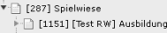
   
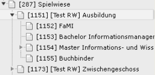

Vor dem Titel der Seite finden sie in eckigen Klammern die ID der Seite im Seitenbaum. Jeder Benutzer sieht den kompletten Seitenbaum, besitzt aber nur für bestimmte Seiten die Zugriffsberechtigung zum Bearbeiten.

**Tipp:** Die Zugriffsberechtigungen der Abteilungen und Gruppen können Sie im Wiki einsehen unter https://wiki.sub.uni-goettingen.de/www-koord/seite/AP_2.4/Startseite:_Rubriken_und_Unterkategorien

Im Seiten- und Dateienbaum sind **Kontextmenüs** mit vielen nützlichen Befehlen verfügbar. Diese Kontextmenüs werden durch einen Klick mit der **rechten oder linken Maustaste** auf das jeweilige **Symbol** vor dem Text oder mit der **rechten Maustaste** auf den **Text** aufgerufen.

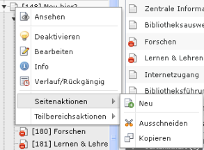
   
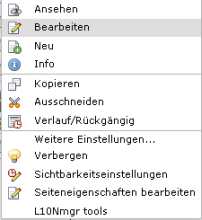

Arbeitsfläche
"""""""""""""

Der große rechte Teil ist die **detaillierte Arbeitsoberfläche**. Hier werden die einzelnen Bestandteile des von Ihnen ausgewählten Elementes angezeigt. Die Bearbeitungsoptionen (und damit auch die Art der Darstellung in der Arbeitsfläche) sind **abhängig** von dem jeweiligen Modul, mit dem Sie gerade arbeiten. Details dazu finden Sie **in den folgenden Kapiteln**. Hier zeigen wir Ihnen als ein Beispiel die Arbeitsfläche für das Editieren eines Inhaltselementes:

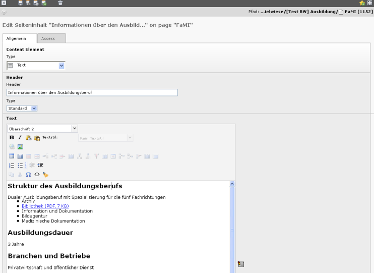

Im Kopf der Arbeitsfläche finden Sie in der Regel den Pfad für das geöffnete Element und Icons zur weiteren Bearbeitung.

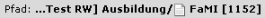

Alle Icons (Bildschaltflächen) zur Bearbeitung Ihrer Seiten und Inhalte sind mit einer sensitiven Hilfe versehen. Das heißt, wenn Sie mit dem Mauszeiger über die Icons fahren, wird Ihnen deren Funktion angezeigt.   

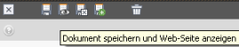

**Tipp:** Falls Ihnen der für die Arbeitsfläche innerhalb des Web-Browsers zur Verfügung stehende Platz nicht ausreicht, können Sie diesen Platz vergrößern: Mit einem Klick auf den Pfeil in der Mitte zwischen Seitenbaum und Arbeitsfläche können Sie den Seitenbaum aus- und wieder einblenden und damit bei Bedarf mehr Platz für die Arbeitsfläche erzeugen.

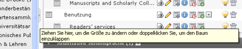

Benutzerwerkzeuge – Einstellungen
"""""""""""""""""""""""""""""""""

Die Voreinstellungen für Ihren Namen und Ihr Passwort sind identisch mit dem Namen und dem Passwort Ihres GWDG-Accounts. Die E-Mail-Adresse, an die ggf. Nachrichten gehen, ist Ihre E-Mail-Adresse, die mit ...@sub.uni-goettingen.de endet.

**Tipp:** Wenn Sie Ihr Passwort beim GWDG-Account ändern, wird es nicht automatisch in das Backend übertragen.
Wir empfehlen Ihnen, alle Felder und Reiter wie voreingestellt zu belassen. Wenn Sie jedoch Änderungen vornehmen möchten, empfehlen wir Ihnen Folgendes:

Sie können Ihre Spracheinstellung im Backend unter Benutzerwerkzeuge und dort unter Einstellungen ändern. Im ersten Reiter "Persönliche Daten" können Sie als Sprache Deutsch oder Englisch auswählen.

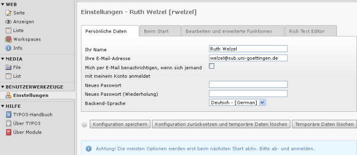

Im zweiten Reiter „Beim Start“ können Sie unter **„Beim Start folgendes Modul aufrufen“** dasjenige Modul wählen, dass Ihnen nach dem Einloggen in das TYPO3-Backend als erstes angezeigt werden soll. Sehr sinnvoll ist z.B. das Modul Liste. 

Wenn Sie auf das mit der Maus über die Titel fahren und das Fragezeichen erscheint, bekommen Sie Erläuterungen. Am Schluss klicken Sie auf „Konfiguration speichern“, um die Änderung zu sichern.

Logout
""""""

Ganz rechts oben, immer sichtbar ohne zu scrollen, sehen Sie den Knopf Abmelden (Logout) und die Anzeige, unter welchem Benutzernamen Sie eingeloggt sind und in welchem Workspace Sie sich befinden.

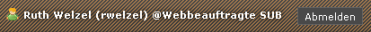

Zum Beenden einer Arbeitssitzung melden Sie sich aus Sicherheitsgründen bitte immer ab.

Übung
~~~~~

* Gehen Sie in der Modulleiste auf Benutzerwerkzeuge und dort auf Einstellungen
* Ändern Sie Ihre Spracheinstellung für die Backend-Sprache in Englisch und speichern Sie die Änderung (Konfiguration speichern)
* Melden Sie sich ab
* Melden Sie sich wieder an
* Ändern Sie Ihre Spracheinstellung wieder in Deutsch und speichern Sie die Änderung (Konfiguration speichern)